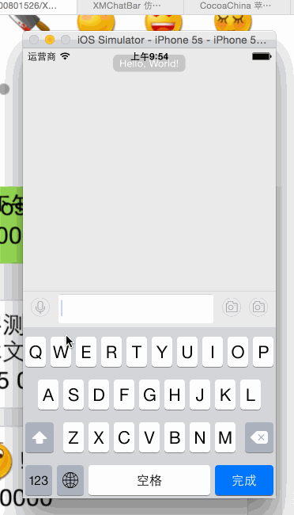
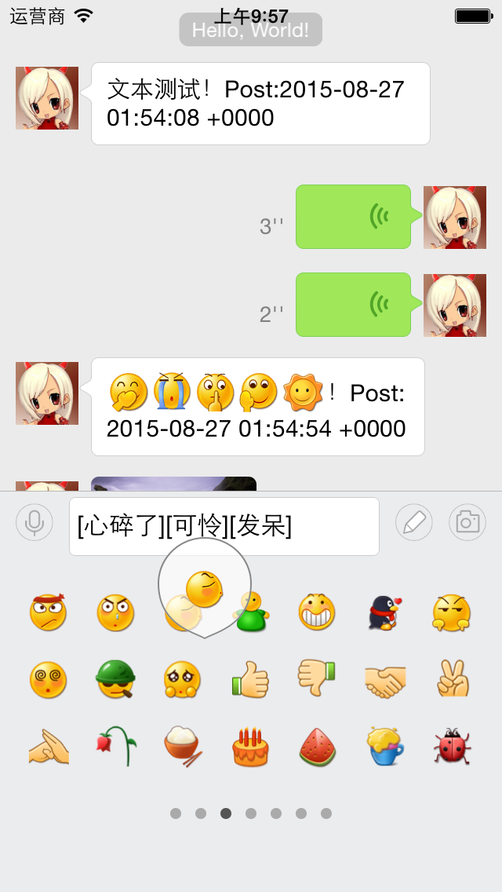
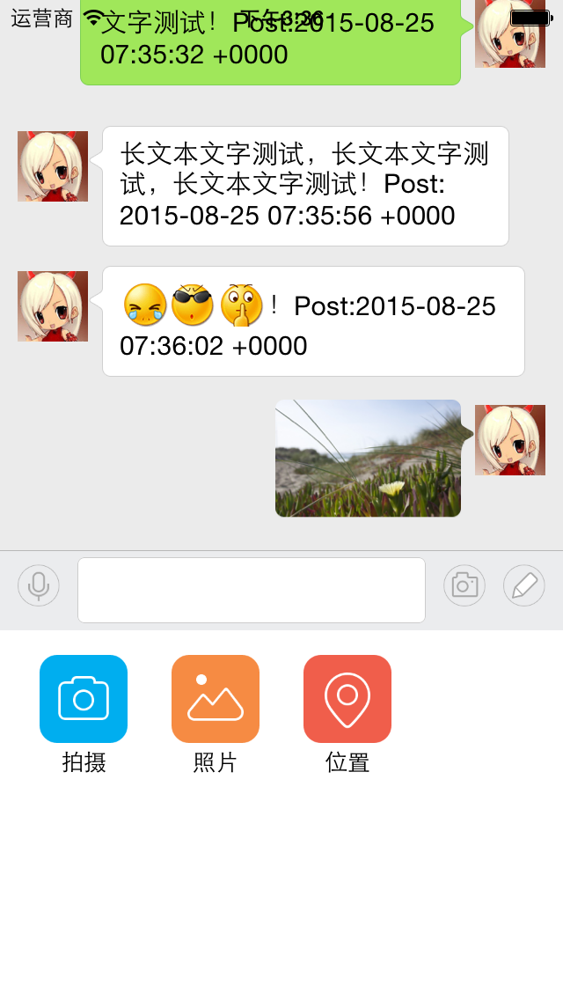

##仿微信聊天输入框

-----
XMChatBar是一个仿微信的输入框,可以输入文字,表情,选择图片,地理位置发送

------

####1. 截图

####2. 相关类说明,介绍

你可以实例化一个XMChatBar 添加到你想要的View上,参考demo中实例即可,pod工程github没有上传,你可以下载demo后 执行`pod install` 或者 `pod install --verbose --no-repo-update`安装即可

--------
[Controllers类名] | 作用
----- | -----
XMLocationController  | 选择地理位置的controller

[Helpers类名] | 作用
----- | -----
XMAVAudioPlayer | 录音播放工具,可以播放录音,停止播放录音
XMFaceManager  | 表情管理,可以获取所有的表情名称,以及对应图片名

[Views类名]() | 作用
----- | -----
[XMChatBar] | 聊天输入框
[XMChatMoreView] | 更多view,用来显示选择图片,拍照等按钮
[XMChatFaceView] | 显示表情view,用来选择表情
[XMChatMoreItem] | moreView的itemView
[XMProgressHUD]  | 录音HUD

####3. 使用到的第三方类库

第三方库 | 说明
----- | -----
[PonyChatUI](https://github.com/PonyGroup/PonyChatUIV2) | 一个很好的聊天界面布局,作者还未完成,期待作者的更多功能
VoiceLib | 一款第三方录音类库,使用方便
[Masonry](https://github.com/SnapKit/Masonry) | 第三方的代码自动布局
AsyncDisplayKit | PonyChatUI需要的 第三方类库

####4. 感谢
感谢[UUChatTableView](https://github.com/ZhipingYang/UUChatTableView),[PonyChatUI](https://github.com/PonyGroup/PonyChatUIV2)  这是一个学习过程中写的,如果有什么问题,可以[问我](https://github.com/ws00801526/XMChatBarExample/issues),或者发送我的邮箱3057600441@qq.com
本示例中用到的图片来自QQ,微信,请尊重版权