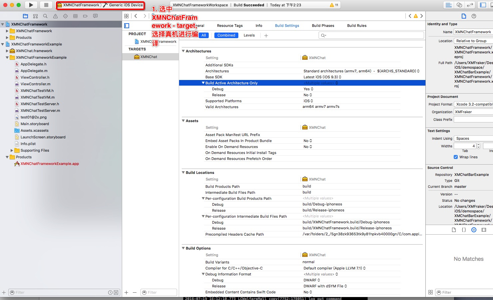
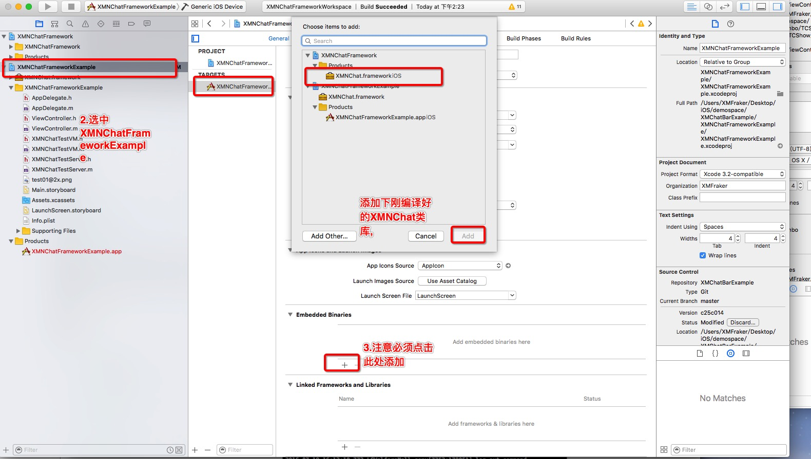
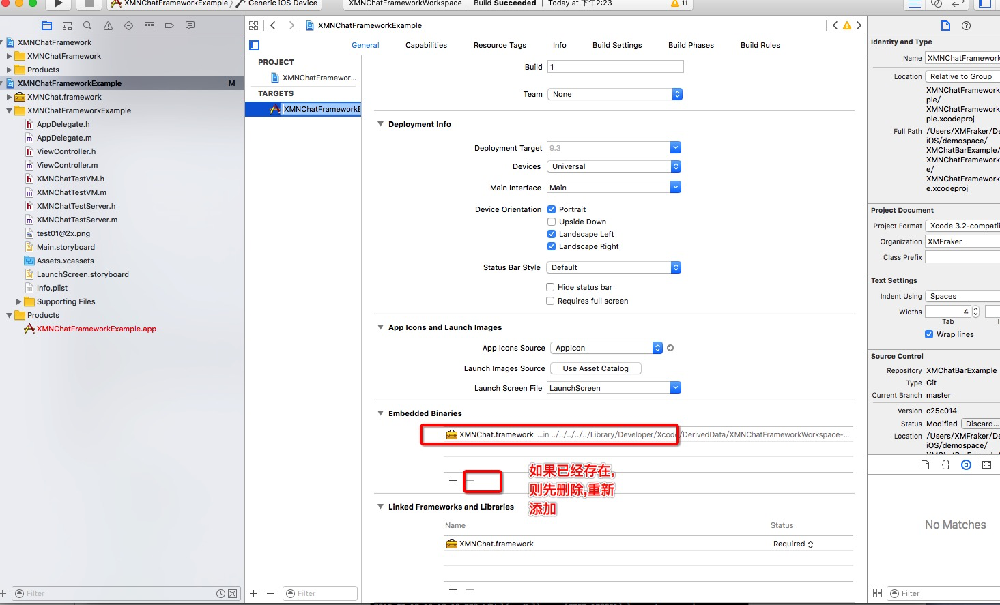
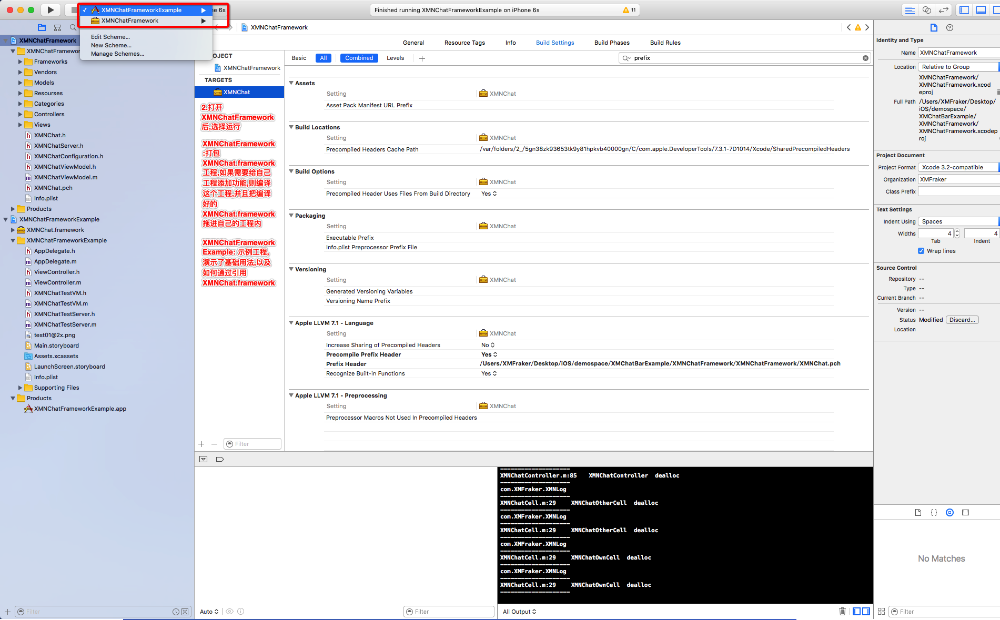

##仿微信聊天输入框

-----
XMChatBar是一个仿微信的输入框,可以输入文字,表情,选择图片

------

#### 重要提示,关于demo缺少XMNChat.framework运行部起来问题,请参考下列截图

#### v1.4.0版本 工程全部重构了,去除pods集成的Masonry依赖,增加以下第三方框架

第三方库 | 说明
----- | -----
[XMNPhotoPicker,XMNPhotoBrowser](https://github.com/ws00801526/XMNPhotoPickerFramework) | 基于YYWebImage封装的第三方图片选择框架,图片浏览框架
[FBKVOController](https://github.com/facebook/KVOController) | facebook的kvo框架
[XMNAudio](https://github.com/ws00801526/XMNAudio) | 基于lame,libopencore封装的 录音,播放框架,可支持播放本地,网络音频文件,可播放 amr,MP3文件
[YYText](https://github.com/ibireme/YYText)  |  ibireme大神的文字处理框架,强烈支持

#### 一. 目前功能
	1. 发送普通文字消息
	2. 发送图片消息
	3. 发送语音消息,播放网络语音文件
	4. 支持新版QQ表情,老版QQ表情选择
	5. 直接图片点击大图预览
	6. 发送表情以gif动图显示
	
#### 二. TODO
	1. 增加地理位置消息
	2. 增加名片消息
	3. 表情管理系统,增加GIF表情
	4. 选择相册,拍照功能

####. 截图

#### 使用说明

1. 下载github上工程, 参考示例Example
2. 录音支持MP3,amr两种格式,如不需要MP3 - 可删除lame.framework 减小包体积

#### 感谢
这是一个学习过程中写的,如果有什么问题,可以[问我](https://github.com/ws00801526/XMChatBarExample/issues),或者发送我的邮箱3057600441@qq.com
本示例中用到的图片来自QQ,微信,请尊重版权

#### 更新

#####V1.3.0 -> 强烈推荐更新至1.3.0  非常抱歉之前版本有不少bug

1. 重写了XMNChatMessageCell
2. 使用了ViewModel管理数据,简化了CHatViewController
3. 重写了XMVAudioPlayer,修复了之前版本有语音Cell 导致的问题  -- 增加了简单的本地文件缓存,可以将网络MP3缓存至本地

#####V1.2.2
1. 修复一个头像拉伸的bug
2. 增加了一个ChatListController ,demo测试,可以让大家参考下
3. ChatViewController 分成了XMChatTypeSingle,XMChatTypeGroup两种,默认XMChatTypeSingle

#####V1.2.1
增加pod使用方法
pod XMChatBar

#####V1.1
1. 去除了PonyChatUI的依赖,因为该类库依赖于AsyncDisplayKit,本人不太熟悉,所以重新参照PonyChatUI重新写了个ChatViewController
2. 加入了pods 工程,因为不少小伙伴下载后缺少pods工程无法打开,这次特地一起上传了上来
3. 使用方法请参考,ChatViewController,也可以直接使用,没有继承下拉加载更多消息

